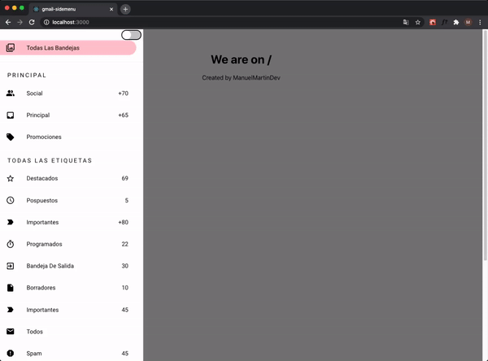
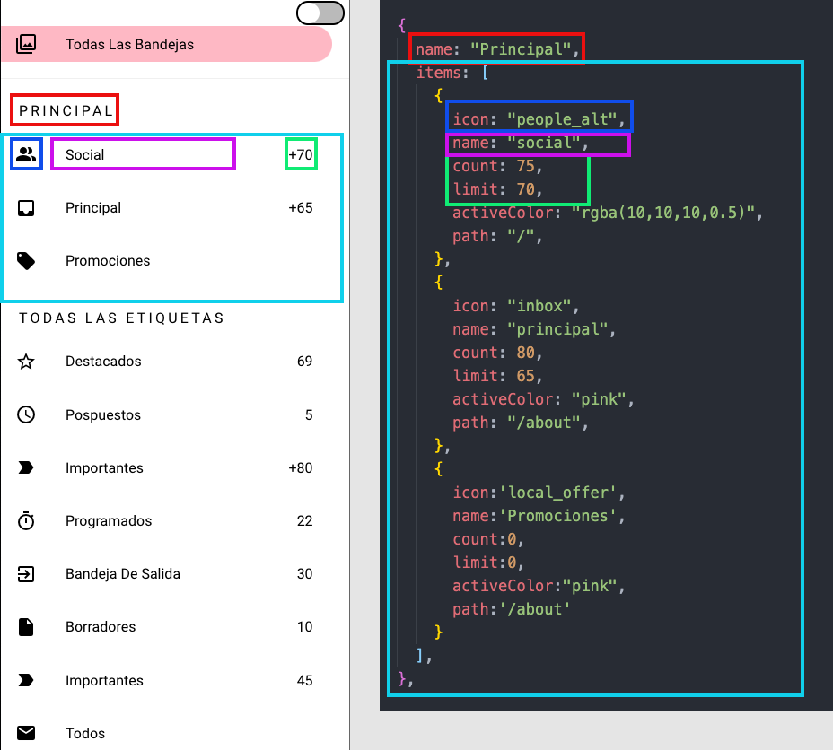

# gmail-sidemenu




## a react gmail-like sidemenu component ready to easily set up for your SPA

[](https://www.npmjs.com/package/gmail-sidemenu)


### You can see a live example [Here](https://manuelmartindev.github.io/gmail-sidemenu/)


## Install

```bash
npm install --save gmail-sidemenu
```

#### Required CDNS

The component use React Material icons and Roboto Font-Family so you will need to add this two CDN
just put this two lines in the header tag of the html

```html
<link
  href="https://fonts.googleapis.com/css2?family=Roboto:wght@400&display=swap"
  rel="stylesheet"
/>
<link
  href="https://fonts.googleapis.com/icon?family=Material+Icons"
  rel="stylesheet"
/>
```

### Usage

This side-menu is created to work with Single Page Applications
so first you will need to setup a basic React Routing

```jsx
import React from 'react'
import { BrowserRouter as Router, Route } from 'react-router-dom'

const App = () => {
  return (
    <Router>
      <Route path='/'>
        <h1>We are in home</h1>
      </Route>
      <Route path="/otherroute">
      <h1> We are in other route </h1>
      </Route>
    </Router>
  )
}
```
now that we finished our basic React Routing Example , it's time to import the component,
go to the top of the file and import the component pasting this code

```jsx
import { Sidemenu,useMenu } from 'gmail-sidemenu'
import 'gmail-sidemenu/dist/index.css'
```
Sidemenu is the component of the Menu and useMenu is a hook to easily work with it
now that we have everything imported we will go step by step on how to configure

#### Step 1

First step is configure the elements that your menu will have , I made this process super easy
you just need to create a array of objects following this structure


##### Basic Example
```javascript
const Elements = [
  
  {
    name:"Section 1" // The name of the section (it can be a empty string so it doesn't have any),
    bordered:true, // If true the section will have a soft borders on the top and the bottom
    items:[ // All the items that this section will contain
      {
        icon:'filter', //The Material Icon name , you can check in Material icons the icon you want and it's name
        name:'Todas las bandejas', // the Name of the item
        count:0, // A number that can be useful for example to show number of messages etc (if 0 it won't show)
        limit:0, // If the number passed on the count attribute overpass this limit , it will show the last number allowed and a + sing
        activeColor:"rgba(10,10,10,0.5)", // The color that the item will have when we are currently on that Route
        path:'/' // The route where it will take you when you click on it
      },
      {
        icon: "people_alt",
        name: "social",
        count: 75,
        limit: 70,
        activeColor: "rgba(10,10,10,0.5)",
        path: "/otherroute",
      },
    ]
  },
    {
    name:"Section 2" 
    bordered:false, 
    items:[ 
      {
        icon:'report', 
        name:'Todas las bandejas', 
        count:0, 
        limit:0, 
        activeColor:"rgba(10,10,10,0.5)", 
        path:'/' 
      },
      {
        icon: "delete",
        name: "social",
        count: 75,
        limit: 70,
        activeColor: "rgba(10,10,10,0.5)",
        path: "/otherroute",
      },
    ]
  },
  //.....
]
```

if you still don't see it clear here is a image that will make you understand everything better





##### Gmail Example
Okay so now that we saw what each atrribute does , I will let a example of one to do a clone of the gmail one:

```jsx

const Gmail_Example = [
  
  {
    name:"",
    bordered:true,
    items:[
      {
        icon:'filter',
        name:'Todas las bandejas',
        count:0,
        limit:0,
        activeColor:"pink",
        path:'/'
      }
    ]
  },
  
  {
    name: "Principal",
    items: [
      {
        icon: "people_alt",
        name: "social",
        count: 75,
        limit: 70,
        activeColor: "rgba(10,10,10,0.5)",
        path: "/",
      },
      {
        icon: "inbox",
        name: "principal",
        count: 80,
        limit: 65,
        activeColor: "pink",
        path: "/about",
      },
      {
        icon:'local_offer',
        name:'Promociones',
        count:0,
        limit:0,
        activeColor:"pink",
        path:'/about'
      }
    ],
  },

  {
    name: "todas las etiquetas",
    items: [
      {
        icon: "star_border",
        name: "Likes",
        count: 69,
        limit: 70,
        activeColor: "red",
        path: "/about",
      },
      {
        icon: "schedule",
        name: "Pospuestos",
        count: 45,
        limit: 50,
        activeColor: "orange",
        path: "/about",
      },
      
      {
        icon:'label_important',
        name:'Importantes',
        count: 45,
        limit: 50,
        activeColor: "orange",
        path: "/about",
      },

      {
        icon:'timer',
        name:'Programados',
        count: 45,
        limit: 50,
        activeColor: "orange",
        path: "/about",
      },

      {
        icon:'exit_to_app',
        name:'Bandeja de salida',
        count: 45,
        limit: 50,
        activeColor: "orange",
        path: "/about",
      },

      {
        icon:'insert_drive_file',
        name:'Borradores',
        count: 45,
        limit: 50,
        activeColor: "orange",
        path: "/about",
      },
      {
        icon:'label_important',
        name:'Importantes',
        count: 45,
        limit: 50,
        activeColor: "orange",
        path: "/about",
      },
      {
        icon:'email',
        name:'Todos',
        count: 45,
        limit: 50,
        activeColor: "orange",
        path: "/about",
      },
      {
        icon:'report',
        name:'Spam',
        count: 45,
        limit: 50,
        activeColor: "orange",
        path: "/about",
      },
      {
        icon:'delete',
        name:'Papelera',
        count: 45,
        limit: 50,
        activeColor: "orange",
        path: "/about",
      }
    ],
  },

  {
    name:'GOOGLE APPS' ,
    items: [
      {
        icon:'calendar_today',
        name:'Calendario',
        count: 20,
        limit: 10,
        activeColor: "orange",
        path: "/about",
      },
      {
        icon:'contacts',
        name:'Contactos',
        count: 30,
        limit: 50,
        activeColor: "orange",
        path: "/about",
      },
      
    ]
  },
  {
    name:'',
    items:[
      {
        icon:'settings',
        name:'Ajustes',
        count: 45,
        limit: 50,
        activeColor: "orange",
        path: "/about",
      },
      {
        icon:'help_outline',
        name:'Ayuda y comentarios',
        count: 45,
        limit: 50,
        activeColor: "orange",
        path: "/about",
      }
    ]
  }
];
```

You can use this as template and then change what you need


#### Step 2

Now it's time to use our useMenu Hook

Right before the Return statement of our App component we will deconstruct the elements that useMenu return like this

```javascript
const [isOpen , ToggleMenu , Theme , ToggleTheme] = useMenu()
```

#### Step 3

Now that we have ready the items that we will be using is time to pass all the Props that are necessary
don't worry we will explain what each Prop does

So we will update our Sidemenu component and now should look like this

   

```jsx
const App = () => {
  const [isOpen, ToggleMenu, Theme, ToggleTheme] = useMenu()
  return (

    <Router>
      <Sidemenu 
      logo={""} 
      ToggleTheme={ToggleTheme} 
      Theme={Theme} 
      ToggleMenu={ToggleMenu} 
      isOpen={isOpen} 
      Groups={Gmail_Example}
      switcher={true}
      >
      </Sidemenu>
      <Route path='/'>
        <h1 onClick={() => ToggleMenu()}>Open</h1>
        <h1>We are in home</h1>
      </Route>
      <Route path="/otherroute">
      <h1> We are in other route </h1>
      </Route>
    </Router>
  )
}
```
Now we will explain each Prop

>logo -> Here you can pass any component for your Logo , and apply your own styles to it

>ToggleTheme -> This is the function that changes the Theme , you should not worry about this , it's for internal use

> Theme -> If the switcher prop is true , you dont need to do anything with this , if switcher is false you can give a fixed value as a string 'Dark' for dark theme or 'Light' from Light theme

> ToggleMenu -> This prop will be used for open/close the Menu

> isOpen -> This is for internal use , for the component to check when the menu is open or closed

> Groups -> The array of objects that we defined before with our menu elements

>Switcher -> If true a theme switcher will apear on the menu


Nice! now our cool menu is showed up , but , how do I open/close it ? 🤔

#### Step 4

Here you have two options:

##### 1. Create your own
this option give you the freedom or use what you want as element that will open it
you can create your own hamburger icon and just pass as onClick the ToggleMenu callback!
  
##### 2. If you dont want to spend time creating one , you can just use this example
   ```html
    <span onClick={ToggleMenu} style={{cursor:'pointer' , fontSize:'2.4em'}} class="material-icons">
    menu
    </span>
   ```

# Our Menu is Ready !! 🚀


## License

MIT © [ManuelMartinDev](https://github.com/ManuelMartinDev)
